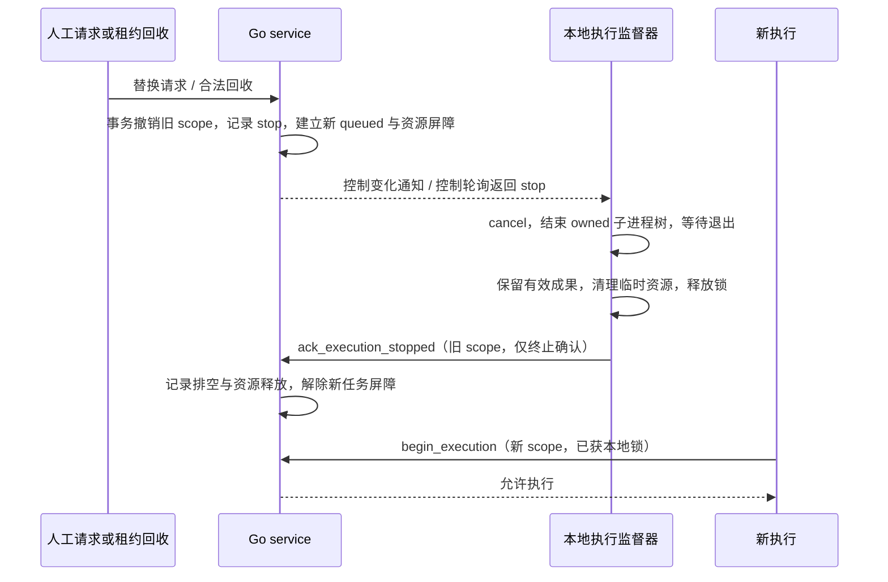

# 第七阶段执行隔离与断点恢复修复方案

实施更新（2026-10-02）：本方案 A–G 已实现并通过 T01–T20 工程复验，当前结果见 [修复报告](七阶段执行隔离与断点恢复修复报告.md)。以下“尚未实现/本轮仅编写方案”是 2026-10-01 的立项背景，保留为原始契约，不能作为当前进度。

日期：2026-10-01。交付对象：后续实现 Agent。**本文为已确认修复方向的完整开发方案，尚未实现，不代表 F7-01/F7-02 已关闭。** 本轮仅编写方案，不修改业务代码。以 [七阶段验收记录](七阶段验收记录-2026-10-01.md) 为问题基线，以 [七阶段开发文档](七阶段开发文档.md) 为原阶段契约；人工验收继续统一后推。

用户要求：使用统一切面校验执行 ID；新任务替换旧任务时中断并清理旧执行；需要保护旧执行的场景由资源锁禁止新任务；补全异常隔离、重连、成果恢复和断点继续。实现者须交付代码、迁移、故障测试及修复报告，不能只添加几处 try/except 或散落 ID 判断。

## 1. 范围与当前缺口

| 问题 | 当前事实 | 本方案交付目标 |
|---|---|---|
| F7-01 旧执行污染新执行 | checkpoint/submit 校验 execution_id，但 heartbeat/progress/fail 仅校验 Agent/task；同 Agent 重领可被旧进程标记失败 | 全部导入执行读写统一鉴权；先撤销旧权限，再排空旧执行，最后允许新执行工作 |
| 替换只改数据库状态 | 当前无独立执行控制协议、资源交接屏障和可追溯排空确认 | 可抢占与不可抢占策略；本地进程监督、资源互斥、停止确认、恢复清理 |
| F7-02 连接错误退出 Worker | process_ingest 未隔离 TransportError，主循环也未兜底；启动脚本遇到 Worker 退出会结束整套会话 | 连接故障不作为媒体失败；任务故障隔离、存活重连、局部监督与恢复 |
| 恢复边界不足 | 当前 receipt 只恢复同一 execution；binding 只保留最新执行；已登记 checkpoint 有复用逻辑 | 保存执行历史与本地恢复日志；应答丢失可核对；重领后核验、接管旧成果，续跑未完成块 |

修改重点为 Go service/store/MCP、Python ingester 和本地启动监督。旧 EDL 输入及第五/六阶段协议继续兼容；资源与控制接口按角色鉴权，不增加任意目录、任意 PID 操作或远程命令工具。只接入现有 queue，不新增竞争调度器。

## 2. 必须成立的约束

1. Agent 身份、Worker 进程实例、task_id、execution_id 是不同身份；相同 Agent 不代表同一执行。每次实际重领生成新 execution_id 与递增 generation。
2. 当前执行身份从 claim 响应获得，取输入、控制轮询及所有写入都携带；旧执行不能通过再次 get_task_input 偷换成最新 ID。
3. 执行撤销在数据库事务提交时立即生效；物理进程退出由本地监督器完成。断网时无法承诺瞬间远程停止，因此必须有本地租约截止和新执行资源屏障。
4. 新任务可被接受为 queued，但拿到执行身份不等于允许启动媒体子进程。资源已交接且 begin_execution 成功后才能工作。
5. 同一资源不能同时被旧、新执行写入或清理。资源租约过期、锁文件存在与否、单个 PID 不存在，都不能单独证明旧进程树已经退出。
6. 停止旧执行保留已验证 checkpoint、已发布包和原始快照；“清理”只处理本次 owned 临时文件、句柄、进程及锁。
7. 传输不确定不伪报媒体失败，不无条件重做已完成步骤；输入/版本不一致的成果不可恢复。
8. 任何上报都不能延长已过期导入执行的权限；断线时超出本地授权期限必须停止子进程并释放资源。
9. 所有恢复与取消均有界、可取消、可观测；不是无限 while 重试。只有无任务的连接等待可在守护循环中持续进行有界退避。

## 3. 统一执行 ID 校验切面

### 3.1 结构与接入

采用 **service 层统一拦截器/装饰器**。MCP 仅解析请求和传入鉴权身份，业务方法通过同一个 guard 进入事务；不依赖 HTTP middleware 单独检查，更不能在 transport 检查后裸写数据库。

建议在 `internal/service/execution_guard.go` 定义显式 `ExecutionScope` 与 `WithExecutionTx(ctx, scope, operation, callback)`，作用是 AOP 风格的统一前置/后置切面，无需引入 AOP 框架。scope 至少包含服务端 Agent/role、runtime_instance_id、task_id、execution_id、generation；需要产物的请求另有 input_sha256。

切面事务内读取 task、execution、binding、run、asset，统一检查：

- 身份与角色、执行所属 Agent/实例；执行 ID/generation 与当前 binding 一致。
- 当前 task/run/计划、执行未撤销、允许状态、租约有效、资产治理许可。
- 对资源写入：已 begin，资源归属当前 generation，交接屏障已解除。
- 对 checkpoint/结果：固定输入、策略/计划指纹、受控目录、幂等请求与内容摘要。

重量文件核验在事务外做有界读取，事务内再次核验身份/版本和资源状态后落库，避免 TOCTOU；不在 SQLite 写事务中等待网络、杀进程或扫描大文件。旧结果同内容重复确认是受限幂等分支，不允许借此恢复旧执行的写权限。

### 3.2 覆盖范围

| 入口 | 规则 |
|---|---|
| claim_task | 身份/实例校验；事务分配执行与 generation，响应返回 scope、控制版本、服务器租约剩余量 |
| get_task_input / get_execution_control | 导入任务必须携带 claim 的 scope；只返回该执行的输入/控制，旧 scope 不返回新 scope |
| heartbeat(task_id 非空) | 导入 scope 必填；执行过期/撤销不可续租；普通历史任务保留既有兼容行为 |
| report_progress / fail_task | 导入 scope 必填；旧执行不改变新进度、错误、租约、审计或 run |
| begin_execution | scope 校验、资源授权和交接完成后，标记当前执行可以执行 |
| save_ingest_checkpoint / submit_ingest_result | 复用切面；保留现有路径、哈希、类型与来源核验 |
| ack_execution_stopped | 独立“旧执行终止确认”权限：只允许已撤销执行的原持有实例确认停止，不能修改新任务或续租 |
| 查询提交状态/恢复候选 | 当前 scope/已知请求 ID 受限读取，不能列出其他 Agent 或任意目录 |

所有方法显式传 scope；不把 context 中缺失字段当作可信内部调用。普通历史任务可无 scope；有 ingest binding 的任务缺失/旧/错配 scope 必须拒绝。checkpoint/result 不再维护一套不同的执行判断。

控制切面需按 operation 区分权限：已撤销执行的原持有实例仍可读取**自己的 stop/排空状态**并确认停止，也可查询自己的已知提交请求是否 committed；这些受限分支不能返回新执行输入或 scope，不能续租或写进度/结果。不能为了严格拒绝旧业务请求，同时阻断通知旧执行停止和核对已提交应答的通道。

### 3.3 实例与领取应答丢失

每次 Worker 主进程启动生成新的 runtime_instance_id。绑定到已鉴权 Agent 并保存在执行记录中；同 Agent 的第二个活动实例不能静默接管旧实例。实例接替必须进入本方案的撤销/排空或拒绝策略。

claim 增加 request_id，与实例绑定并持久幂等。领取响应丢失时，同 request_id 只返回原领取的 scope 或其 obsolete 状态；不得把后来新领取的 scope 当作原请求成功返回给旧进程。能力心跳不能刷新已撤销执行的授权，也不能绕过实例冲突。

## 4. 旧执行终止、资源锁与新任务启动

### 4.1 两种策略

| 策略 | 使用场景 | 新请求行为 |
|---|---|---|
| replace_after_stop | 明确取消后重跑、合法租约回收、用户要求用新版取代旧版；尚未开始不可中断的发布动作 | 在同一事务撤销旧执行，持久化 stop 命令，创建新 queued 任务及等待屏障；旧执行排空后才能 begin 新执行 |
| reject_if_busy | 有效执行占用共享源写入、不可抢占设备或短暂发布临界区；用户未要求取代现有任务 | 409/resource_busy，返回去敏占用原因；不新建任务、不撤销旧执行、不留下计划/审计半成品 |

策略由服务端确定，人工 REST 可以显式请求 replace；Agent 不可自行选择强制抢占。一般同资产重复启动维持当前拒绝语义；“创建新任务即中断旧执行”只适用于接受了替换的路径，不包括正常成功后排下一阶段。

合法 lease 回收可以创建下一执行，但不能仅以 lease 过期为依据打开新资源。不可抢占旧任务仍持有效许可时拒绝新任务；一旦旧许可失效，禁止旧执行继续工作，进入排空/恢复，不让陈旧锁永久维持计算权限。

### 4.2 顺序与屏障

撤销旧 scope 与创建替换 task/run/控制记录须原子完成；现有 one-active-run 唯一索引在事务内先使旧 run 非活动，再插入新 run，保留完整历史。若无法完成全部操作，回滚，不对外发布虚假的新任务。正常下一阶段不能提前撤销已提交成功的历史结果。

事件仅加速，不是可靠交付依据。初版必须有持久化控制记录 + 鉴权 MCP 控制轮询，每个活动执行最多一条轮询，请求最长等待 2 秒、网络超时最长 3 秒；在线时以 3 秒内发出 cancel 为验收目标。不得使用现有人类 SSE 流代替 Worker 鉴权通道。

停止采用 cooperative cancel → 有界等待 → 强制结束本次 owned 进程树 → 等待并核对退出。建议停止宽限 5 秒、强制退出等待 10 秒，超限进入 cleanup_blocked，**禁止新执行启动**，不写“已清理”。本地监督器只操作自己登记的 PID、启动标记与进程归属；不能接受服务端任意 PID，也不能按 python/ffmpeg 等通用名称杀进程。

### 4.3 两层资源互斥

资源键由服务端根据操作生成，例如 `source_snapshot:<source_id>`、`asset_input:<asset_id>`、`device:<本机受控设备槽>`，不接受客户端任意路径。快照写入独占；已发布 immutable 快照允许读取，不把多个纯读扫描全部互斥。每执行 owned 输出目录互不共享。

- **控制面逻辑锁**：持久化资源 owner scope、generation、策略、交接状态；事务分配，审计清楚，可展示等待原因。
- **本地物理锁与进程监督**：同一 delivery_root 下跨进程互斥，确认同机其他实例也遵守。不得以删除锁文件强制解锁；锁描述只作诊断，实际授权不能仅由文件时间推断。

begin_execution 需同时满足逻辑锁授权、本地物理锁成功和上个 owner 排空证据。Worker 获取本地锁后复核服务器授权，再启动子进程；复核失败释放锁。多个资源按稳定顺序获取，获取失败立即释放已取得的锁，不死锁等待。

仅服务器 TTL 到期不释放本地占用；仅物理锁可获取也不证明遗留 FFmpeg 已退出。实现者应使用本地运行监督记录和进程树生命周期机制，覆盖主 Worker 崩溃、子孙进程遗留的场景：先处理上一 owner 的进程树/句柄，再确认 drain，再交接资源。无法证明旧进程归属或退出时，保持 blocked 并给出诊断，禁止越权清理。

“立即清理”不包含删除检查点成果：移除未完成临时块、未完成编码文件、临时句柄及本次任务 IPC；保存已完成块/短片、sealed 包和恢复日志。文件清理前解析真实路径、拒绝 reparse 逃逸、核对 owner scope 与引用关系；恢复候选尚未接管前不得删除。

## 5. 执行监督与异常隔离

### 5.1 本地职责

建议将 `run_ingest_loop` 改为长期存活的 Worker 监督器：负责鉴权会话、控制轮询、租约、重连和 owned 资源；每个媒体执行使用可单独停止的执行上下文/子进程。现有 Exec/Runner、media_probe/segment/media_prepare 保持阶段职责，网络重试集中在连接层，执行 ID 注入和资源管理集中在监督层。

阶段子进程崩溃不得杀死长期 Worker；如采用子进程隔离，父子 IPC 有界，禁止死锁等待未响应网络。token 仅从继承环境传入，不落盘、不作为命令行参数。父进程退出时本次媒体子进程树也必须被终止；不能只 Kill 主 Worker 留下 FFmpeg。

单进程实现也须实现相同的监督、停止、异常边界和崩溃遗留恢复门槛；不得只加线程 Event 就宣称已做到进程级隔离。

### 5.2 错误分类

| 类别 | 示例 | 行为 |
|---|---|---|
| 短暂连接故障 | 连接拒绝、超时、可重试 5xx、响应丢失 | 保留成果/待确认请求；有界退避；不 fail_task，不退出守护 Worker |
| 身份或配置故障 | 401/403、角色错配、协议/schema 不兼容 | 停止本次执行；实例进入 blocked/degraded；低频探测或等待配置修正，不高频重试或外部回退 |
| 失去执行权 | stale_execution、lease_expired、cancelled、治理撤销 | 立即 cancel，排空与清理临时资源；不对新 task 写失败，不尝试借新 ID 继续 |
| 永久媒体/输入错误 | 损坏源、指纹变化、非法流/范围、明确预算超限 | 当前 scope 下报告本任务失败；保留合理诊断与可复用成果，不影响其他任务 |
| 可恢复执行故障 | 子进程中断、暂时磁盘不足、扫描/编码超时 | 保存已验证 checkpoint；当前任务进入可见失败/等待人工重试，不自动提高资源预算 |
| 非预期单任务异常 | 阶段异常、IPC 错误、数据读取错误 | 单任务边界捕获，停止本次子进程；规范化报告；主循环继续，重复故障受 attempt cap 限制 |
| 启动致命故障 | 缺关键程序、无法解析配置 | 启动失败明确返回；不把配置故障伪装为无限重连 |

不吞掉进程级停止信号。异常文本去敏，HTTP/JSON-RPC 协议解码错误也分类处理；不将任何非 200 都盲目当成 TransportError 无限重试。

### 5.3 租约与重连

保留服务端配置的租约，本地默认示例 60 秒；实际使用 claim/heartbeat 返回的权威剩余量。使用单调时钟计算保守截止，扣除完整请求 RTT 和安全余量，不依赖客户端墙钟与服务器完全一致。

建议请求超时 ≤3 秒，退避 0.5/1/2/4/8 秒、上限 8 秒并加有限抖动；操作重试预算默认 20 秒，且永远不超过当前执行本地截止减去停止余量。循环等待用可中断 Event，不使用不可取消长 sleep。心跳和控制请求不能被提交重试阻塞，限制每执行同时在途请求数。

断线时不启动新的复制块/扫描块/短片编码；允许当前块只在已授权时间内完成，写本地恢复日志后暂停。到本地截止仍未恢复：停止 owned 子进程、释放资源，标记 suspended_connection；不能以“心跳正在重试”无期限继续计算。

重连先重新鉴权/确认实例与执行控制，后核对提交状态、再补报日志，最后继续。若执行已回收或新版已创建，旧执行必须排空；新执行走恢复候选核验，不能让旧执行改拿新 ID。

## 6. 成果恢复与真正断点继续

### 6.1 本地恢复日志

每执行 owned 目录增加版本化 journal（如 `journal.v1.json`），用临时文件写入、flush/fsync 和原子替换发布；大小、记录数及路径有界。记录 scope、固定输入/策略/工具版本、已完成条目、内容哈希、阶段、待确认请求 ID/精确参数及 sealed package 摘要，不记录 token 或原始绝对目录。

阶段完成后的顺序为：写完并核验成果 → 持久化 journal/manifest → 发送 checkpoint → 确认服务端接收。响应丢失时保留同一 sequence/request_id 和完全相同的参数，核对或重复发送；不跳 sequence、不改 manifest 后复用同一键。

区分 `verified_local`、`registered`、`sealed`、`committed`。本地已经完成但尚未登记不丢弃；只有经过恢复协议验证才可被后继执行采用。恢复日志损坏不得触发任意文件操作。

### 6.2 各阶段续跑要求

| 阶段 | 续跑单元 | 需要验证 | 中断处理 |
|---|---|---|---|
| media_probe | 已复制的完整块/连续前缀 | source_version、size/mtime、块大小、前缀块哈希、part 归属；最后完整块前缀无洞 | 仅丢最后未完成块，续复制剩余字节；整源未变才恢复 |
| segment | 独立分析块及 overlap 范围 | 输入/策略/检测版本、块范围、完成标记、cuts 文件哈希 | 已完成块不再次调用 FFmpeg；只补缺失块，最后确定性去重/长度规则 |
| media_prepare | 单个已核验 CFR 短片 | 源/选择/目标 fps、音轨、样本/帧计数、工具与算法版本、内容哈希 | 完成短片不重复编码；未完成短片整体重做，不要求恢复 FFmpeg 内部状态 |
| publish/submit | sealed package + receipt + 内容清单 | 固定输入、scope 历史、manifest/产物哈希、旧 owner 已排空、服务端是否已经提交 | 先查询/幂等确认；未提交的完整包可恢复登记，不重新扫描/编码 |

检查点 manifest 先 stat 再有限读取，禁止 read_bytes 后才限制长度。复制哈希列表不得随 64 GiB 小块配置无限膨胀：使用有界分片 ledger/增量 checkpoint 与可验证链，单 manifest ≤1 MiB；返回列表分页或有界摘要，不累积所有帧/切点/哈希到内存。续跑预算包含恢复校验消耗，不绕过既有时间/磁盘/文件预算。

### 6.3 发布应答丢失与跨执行接管

发布完成不等于服务端已经登记。receipt 必须能定位该执行的 sealed 包和固定指纹；服务器按 request_id/结果摘要查询 committed、not_committed、obsolete、conflict。提交事务与审计、任务成功、run/asset 更新和幂等记录一起提交。

同执行重复提交只接受同内容。若请求已提交但应答丢失，返回原提交结果，不能重新执行或因任务已成功而报假失败。

跨执行恢复只允许当前 owner，从 Go 下发的**历史执行目录候选**选择；初版限定同一 run、同一 stage/固定输入与策略，且来自合法 AttemptOf/回收链。候选使用 former_execution_id、受控 package/checkpoint 引用和摘要，不接受任意目录。

必须先确认旧执行排空且物理锁已交接，再核验旧成果。采用到新 owned 目录，生成新 scope 的 receipt/journal；历史 receipt 不覆盖，记录 recovered_from_execution_id 与来源摘要。Go 校验当前授权以及合法旧执行链，不能直接放行旧 execution 的迟到提交。跨 run 重用发布包不作为初版功能；原始已发布 immutable 快照可按已登记 source 身份复用。

内容/配置/工具版本不兼容则明确 redo 对应单元，不把不可信成果标成 recovered。部分已验证成果保留，其余重做。恢复完成前不清理旧目录；清理按引用和保留策略执行，不能误删历史交付包。

### 6.4 启动与崩溃恢复

Worker 重启先恢复实例会话、检查本地 owned registry，处理遗留子进程与资源；再对照 Go 的执行/控制状态核对 journal。已撤销执行只做排空确认；当前有效执行核对租约后恢复；已被重领的成果供新执行接管。未知目录不自动删除。

Go 重启保留租约、执行历史、stop 命令、资源屏障和幂等结果；不能依赖内存 Bus 恢复。队列扫到过期导入任务时，应撤销旧执行并建立 drain 屏障，再进行新领取。过期 sweep 不直接清空资源 owner 后放行。

## 7. 存储、接口与兼容契约

### 7.1 迁移

使用实现时下一个空闲迁移编号；当前 0001–0009 已存在，若无其他新增使用 0010。不修改旧迁移。表名可调整，但必须包含下列持久信息与约束。

| 表/扩展 | 必要数据与约束 |
|---|---|
| ingest_executions | execution_id、task/run、generation、Agent/instance、固定指纹、状态、租约、owned 目录、停止/排空/提交信息；每个 task 的 generation 唯一 |
| ingest_worker_instances | Agent/role、runtime_instance_id、observed/状态；同 Agent 活动实例冲突受服务策略裁决 |
| execution_controls | 执行、递增 control_version、stop/reason、ack；撤销事务内记录，命令幂等 |
| execution_resources | 受控 resource_key、当前 owner scope/generation、策略、drain/blocked 状态；一个独占资源只能一个 owner |
| execution_requests | 实例/执行与 request_id、操作、内容摘要、结果；领取和结果的应答丢失可核对，有界保留 |
| ingest_task_bindings 扩展 | 继续指向当前 execution；增加执行/交接状态，历史不再只靠覆盖一个 ID |
| checkpoint 扩展 | 本地 manifest/journal 版本、来源执行、条目状态、可验证成果摘要；兼容已有已登记 checkpoint |

执行内部状态可用 allocated/waiting_resource/running/suspended_connection/stop_requested/draining/stopped/succeeded/failed/cleanup_blocked。Task 保留现有队列状态；等待资源/恢复原因放在执行视图，避免无必要扩大所有旧工作流状态机。

### 7.2 接口变更

1. claim_task 新增可选 instance/request_id；导入执行要求填写。响应新增 execution scope/lease/control_version，旧普通任务字段不变。
2. get_task_input、heartbeat、report_progress、fail_task 新增 scope 字段；有 ingest binding 时强制校验。checkpoint/result 统一携带完整 scope。
3. 新增 ingester 工具 begin_execution、get_execution_control、ack_execution_stopped、get_execution_result_status（名称可按现有风格统一）；严格 schema、鉴权、请求体/等待时间上限。
4. 现有 REST start/retry/cancel/新分析计划路径统一接入替换/资源策略；409/resource_busy 和 202/queued_waiting_drain 明确区分，保持 expected_version 与幂等键。
5. run REST 视图添加执行状态、等待原因、连接状态、checkpoint 已完成/总量、恢复来源及清理结果；去敏，不公开 token、绝对目录或未经筛选的 PID。
6. SSE execution.changed/ingest.changed 仅通知 UI 重新拉快照；Worker 控制通道独立鉴权，重连靠持久状态。

更新 `worker_version` 与 capability 中支持的执行协议版本。新控制面对旧 ingester 能力不分配需要新协议的任务，给出升级原因；现有未完成任务迁移为需恢复/重新领取，不给旧无 scope 调用留旁路。旧普通任务/EDL Worker 无需强制同时改协议。

## 8. 启动脚本与界面交接

`Start-LocalPipeline.ps1` 必须保留按 owned 进程启动/停止的边界。运行期间单个 Worker 异常退出应记录角色不可用，并按有界策略重启该角色，不能立即关闭控制面和其余 Worker。建议窗口 60 秒内最多 3 次、退避 1/2/4 秒；耗尽后该角色 blocked，控制台继续可用。

重启创建新 runtime_instance_id，先处理上一实例执行及遗留媒体子进程，确认资源交接再继续。配置或鉴权永久错误不循环重启。Go 控制面故障时 Worker 暂停执行并重连；本轮不要求自动升级或替换服务配置。

用户停止整套会话时：停止接新任务 → cancel 本会话活动执行 → 等待排空/保存日志 → 强制结束仍未退出的 owned 子进程树 → 最后停止控制面；记录未能排空资源。初次启动失败可以回滚本次自有进程，不能影响已有服务。

UI 展示“等待旧执行退出”“资源被有效执行占用”“连接中断，暂停并保留 N 个完成单元”“恢复中”“清理受阻”等实际状态。按钮不暗示正在运行的新任务已启动；不要以任务已创建或 checkpoint 写到本地就展示 100%。本次方案要求实现状态显示和必要布局回归，人工完整验收继续后推。

## 9. 开发拆分与文件边界

| 工作包 | 主要文件范围 | 交付 |
|---|---|---|
| A 统一切面与身份 | service/execution_guard、新 model/store/migration、MCP tasks/schema | 所有导入读写拦截，claim 应答丢失、同 Agent/实例旧 scope 测试 |
| B 替换与资源交接 | service task/agent/requeue/ingest、execution control/resources | 原子撤销、持久 stop、排空 ACK、两种资源策略与 begin 屏障 |
| C 本地监督与停止 | Python ingest supervisor/loop/common/Runner、进程/锁模块 | 本地租约截止、控制轮询、owned 树终止、崩溃遗留处理、安全清理 |
| D 重连与错误隔离 | Python MCP transport、ingest 网络边界、主循环 | 错误分类、可取消有界重试、单任务隔离、连接恢复状态 |
| E 日志与成果恢复 | journal、probe/segment/prepare、Go recovery 候选/状态接口 | 本地未确认成果、发布应答丢失、同/跨执行核验接管、三阶段续跑 |
| F 启动与状态 UI | Start-LocalPipeline、REST view、WebUI/types/SSE | 局部监督、恢复/资源状态、旧界面兼容与宽度验证 |
| G 故障验收与报告 | Go/Python 测试、隔离联调脚本、docs | 下节全部必验，输出修复报告和可复现证据 |

建议顺序 A → B/C → D/E → F → G。若使用多个 Agent，先确定文件所有权；B 与 C 必须先约定控制和 ACK 协议，D/E 必须统一请求日志与幂等格式，不能各自设计第二套状态机。

## 10. 必须自动通过的验收矩阵

| 编号 | 故障/操作 | 必须断言 |
|---|---|---|
| T01 | 同 Agent 回收重领、旧进程迟到 | 旧 get_input/control/write 不得获取/使用新 scope；heartbeat/progress/fail/checkpoint/submit 全部拒绝且新任务不变 |
| T02 | 同 Agent 两个 runtime 实例 | 不静默接管；按 replace/reject 策略处理，无法双 begin |
| T03 | claim 成功但响应丢失，再重复同 request_id | 返回原 scope/obsolete，不再领取第二执行，不给旧进程新 scope |
| T04 | 替换已运行任务 | 撤销即时生效；在线 ≤3 秒发 cancel；旧树退出/锁释放/临时清理后新 begin，严格无并发写 |
| T05 | reject_if_busy | 409，无新 task/run/计划半成品；旧许可、进度和资源保持 |
| T06 | stop 通知丢失、控制面重启、断网 | 持久控制轮询恢复；断线至本地截止停止；新执行资源屏障仍有效 |
| T07 | 旧任务停止/清理失败、父进程崩溃留子孙 | cleanup_blocked，不新 begin；核对 owned 身份后回收，无 unrelated 进程或文件损伤 |
| T08 | 旧 owner ACK 与新任务进度同时到达 | ACK 只关闭旧执行/解除对应屏障，不修改新任务；重复 ACK 幂等 |
| T09 | 输入、checkpoint、提交与恢复查询分别超时/短暂 5xx | Worker 不退出，阶段错误不跨任务传播，重试有界且可取消，恢复后状态准确 |
| T10 | 401/403、协议不兼容、非法 JSON/结果 envelope | 正确分类，不无限高速重试、不借新身份继续；其他 Worker/控制面不被关闭 |
| T11 | checkpoint 成功但响应丢失 | 重试同 sequence/request_id 与同内容；不跳号、不重复逻辑成果；篡改拒绝 |
| T12 | 本地完整块写好但 checkpoint 未到服务端即崩溃 | journal 保留；新执行验证来源/哈希/排空后接管，不重做整个文件 |
| T13 | 复制/扫描/转码分别中断 | 只重做尾部不完整单元；统计剩余字节与 FFmpeg 调用次数，已完成块/短片不重跑 |
| T14 | 发布后未提交、事务已提交但应答丢失、提交重试耗尽 | 分别正确恢复登记/返回原结果/暂停保留 sealed 包；不会重复任务成功、下一阶段或审计 |
| T15 | lease 回收/Worker 重启后的 sealed 包接管 | 新 scope 登记、历史 receipt 不变；旧 scope 仍拒绝；指纹变化不采用旧成果 |
| T16 | 网络故障期间取消/隐藏/锁定/新计划 | 重连先确认撤销；不补报旧结果覆盖新版，旧执行排空 |
| T17 | 主 Worker 崩溃、脚本重启该角色、用户停止会话 | 其余服务保持；重启受 cap 限制；旧树和资源排空；最终停止无 owned 媒体进程遗留 |
| T18 | 磁盘不足、manifest 超限/篡改、junction 路径、未知目录 | 有界拒绝、原源不变、已验证成果保留；清理不得越界或删历史包 |
| T19 | 原始录屏至交付的恢复型 E2E | 合成 MKV、mock 实收帧、真实 SAPI、Node ZIP；至少注入一次扫描中断和发布应答丢失，最终来源/版本/时长正确 |
| T20 | 兼容回归 | Go 全包/vet、Python 全套、两套 Node、WebUI 构建/测试、第五/六/七阶段 E2E 通过；旧普通任务无需 scope 仍正常 |

并发测试使用屏障/可控时钟与可控传输故障，避免靠长 sleep 或恰好发生竞争。真实 Windows 进程树与跨进程锁测试不能全部使用 mocks；要记录停止耗时、启动顺序、owned PID/启动标记和锁归属。真实模拟服务可丢应答但须保证提交事务实际已发生。

现有独立复现见 `.run-data/phase7-audit-2026-10-01/stale_execution_probe_test.go`、`transport_probe.py`；实现者应将核心断言变成仓库内稳定测试。原探针无 scope 的旧调用需继续被拒，并另外测试有当前/旧 scope 的请求，不得仅通过修改探针掩盖缺陷。

其他第七阶段未验工程项目仍在原验收记录中。本修复报告不能单凭关闭 F7-01/F7-02 就宣布第七阶段全部完成；最终 stem 同步、改选段重跑、完整动态 UI、长素材与闪光场景证据仍需按原门槛补齐。

## 11. 实施报告与退出条件

实现者新增 `docs/七阶段执行隔离与断点恢复修复报告.md`，记录 A–G、T01–T20 实际结果、迁移/协议版本、兼容方式、策略与默认超时、恢复来源、局部监督行为、复现命令与退出码、代码/产物指纹、未执行与失败项。

输出隔离 `.run-data/phase7-recovery-<id>/report.json`，区分 `engineering`、`content_provider=mock`、`human_acceptance=pending`，含 fault 注入点、旧/新执行、资源交接时间序列、续跑单元数量/字节、子进程退出证据、sealed/committed 恢复结果。不得写 token、调用真实外部模型或代填真实内容人工通过。

F7-01 关闭条件：统一切面无旁路，旧执行所有读写拒绝，替换和保护旧任务两种策略均通过，进程终止/清理与新 begin 的顺序得到证明。

F7-02 关闭条件：启动与任务连接错误正确隔离；短暂故障不退出 Worker/整套服务；租约截止会停止执行；同/跨执行成果恢复和三阶段续跑有实际证据，重复提交/应答丢失不产生重复结果。

未满足条件时维持 `needs_repair`，不把“有恢复接口”写成恢复通过。保留现有未提交修改，不 reset/clean，不提交或推送无关工作。真实录屏与 Premiere 验收仍按 [统一人工验收计划](全项目统一人工验收计划.md) 集中进行。
